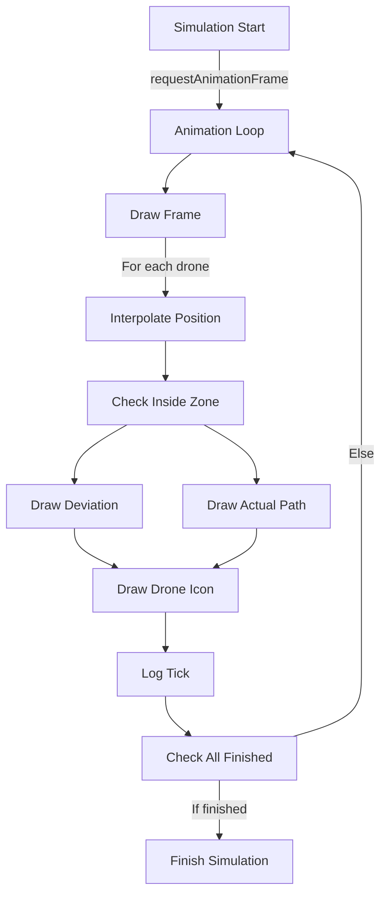

# drone-canvas

The `drone-canvas` component is the **core simulation engine** for the app. It renders all drone movements, paths, and simulation state on a canvas overlaying the map. This is where the main animation, tick logging, and path deviation logic lives.

## High-Level Summary

- Renders drones, their paths, and deviations on a canvas above the map.
- Handles animation, tick logging, and simulation completion.
- Integrates with the map and simulation context.
- **All simulation logic and visual feedback for drone movement is here.**


## Component Signature

```tsx
export function DroneCanvas({ drones }: { drones: Drone[] });
```

## Major State and Refs

- `canvasRef`: Reference to the HTML canvas element.
- `mapRef`: Reference to the Leaflet map instance.
- `dronesRef`, `mzRef`: Refs to the latest drones and monitoring zone.
- `elapsedRef`, `lastFrameTime`: Animation timing.
- `kdTreesRef`: Array of kd-trees for fast nearest-neighbor path lookup.
- `droneFirstTickMap`: Tracks first tick for each drone.
- `tickLogRef`: Shared tick log for simulation analytics.

## Animation & Drawing Flow



## Step-by-Step Walkthrough

1. **Sync canvas size with map**
   ```tsx
   const resize = () => {
     const size = mapRef.current.getSize();
     canvas.width = size.x;
     canvas.height = size.y;
   };
   mapRef.current.on("move zoom resize", resize);
   ```
2. **Animation Loop**
   - Uses `requestAnimationFrame` to update `elapsedRef` and call `draw()`.
   - Stops when all drones finish their paths.
   ```tsx
   const animate = () => {
     const now = performance.now();
     const dt = (now - lastFrameTime.current) / 1000;
     elapsedRef.current += dt;
     draw(elapsedRef.current);
     animationId = requestAnimationFrame(animate);
   };
   ```
3. **Drawing Logic**
   - For each drone:
     - Interpolates position along its path.
     - Checks if inside the monitoring zone.
     - Draws:
       - **Actual path** (colored line)
       - **Approved path** (gray dashed line)
       - **Deviation** (red line, with distance label)
       - **Drone icon** (with risk color)
       - **Speed label**
   - Example:
   ```tsx
   ctx.strokeStyle = riskColors[riskLevel] ?? "blue";
   ctx.lineWidth = 2;
   ctx.moveTo(pathPoints[0].x, pathPoints[0].y);
   // ...
   ctx.drawImage(
     img,
     point.x - imgSize / 2,
     point.y - imgSize / 2,
     imgSize,
     imgSize
   );
   ctx.fillText(`${p0.speed.toFixed(1)} m/s`, point.x, point.y - imgSize);
   ```
4. **Tick Logging**
   - Logs per-tick processing times, risk levels, and first-tick status for each drone.
   - Pushes to `tickLogRef` for later analysis.
   ```tsx
   tickLogRef.current.push(tickEntry);
   ```
5. **Simulation Completion**
   - Checks if all drones have finished their paths.
   - Calls `finishSimulation()` and stops animation.

## Extension Points

- **Add new risk levels**: Update `riskColors` and `droneImages`.
- **Change path logic**: Edit the main loop in `draw()`.
- **Log new analytics**: Add fields to `tickEntry`.
- **Custom drawing**: Add new canvas drawing logic for overlays, labels, etc.

## Related Files

- [`drone-context.tsx`](./drone-context.md): Provides simulation state and context.
- [`lib/utils.ts`](../lib.md#utils): Utility functions for path and tick calculations.

## Screenshots & Diagrams


---

For further customization, see the code comments in `src/components/drone-canvas.tsx` and related context files.
