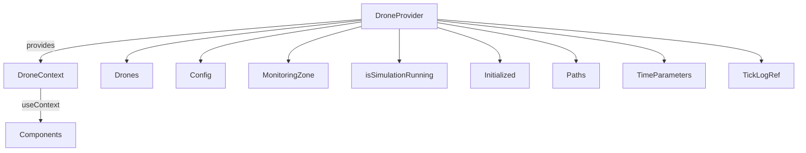

# drone-context

The `drone-context` component is the **global state manager** for the simulation. It provides all simulation data and update functions to the rest of the app via React Context.

## High-Level Summary

- Exposes all simulation state and update functions via context.
- Used by nearly every component to read or update simulation data.
- Handles simulation lifecycle (start, stop, finish, reset), drone management, and tick logging.

## Context Structure Diagram



## Context Values & Types

```ts
interface DroneContextType {
  drones: Drone[];
  config: SimulationConfig;
  monitoringZone: MonitoringZone | null;
  isSimulationRunning: 'stopped' | 'running' | 'finished';
  initialized: boolean;
  setInitialized: (v: boolean) => void;
  addMultipleDrones: (...);
  updateDrone: (...);
  removeDrone: (...);
  updateDroneConfig: (...);
  updateMzConfig: (...);
  setMonitoringZone: (...);
  startSimulation: () => void;
  stopSimulation: () => void;
  finishSimulation: () => void;
  resetSimulation: () => void;
  applyDronePreset: (...);
  applyZonePreset: (...);
  drawnItemsRef: ...;
  animationRef: ...;
  paths: Path[][];
  setPaths: (...);
  timeParameters: TimeParameters;
  setTimeParameters: (...);
  tickLogRef: React.MutableRefObject<TickLogEntry[]>;
}
```

## State Management Walkthrough

1. **Drone Management**
   - Add, update, or remove drones using context functions.
   - Example:
   ```tsx
   const { addMultipleDrones, updateDrone, removeDrone } = useDroneContext();
   addMultipleDrones(3, "default", [0.5, 0.5, 0.5]);
   updateDrone(droneId, { label: "New Name" });
   removeDrone(droneId);
   ```
2. **Simulation Lifecycle**
   - Start, stop, finish, or reset the simulation.
   - Example:
   ```tsx
   startSimulation();
   stopSimulation();
   finishSimulation();
   resetSimulation();
   ```
3. **Configuration Updates**
   - Update drone or monitoring zone config.
   - Example:
   ```tsx
   updateDroneConfig({ flightViolation: ["TFLV01"] });
   updateMzConfig({ weather: "rainy" });
   ```
4. **Tick Logging**
   - All tick logs are stored in `tickLogRef` for analytics and results.

## Extension Points

- **Add new state**: Extend the context type and provider state.
- **Add new update functions**: Add new methods to the context for new features.
- **Custom analytics**: Store new logs or metrics in `tickLogRef` or new refs.

## Related Files

- [`drone-canvas.tsx`](./drone-canvas.md): Uses context for simulation logic.
- [`lib/presets.ts`](../lib.md#presets): Provides default configs and presets.

## Screenshots & Diagrams


---

For further customization, see the code comments in `src/components/drone-context.tsx` and related context files.
